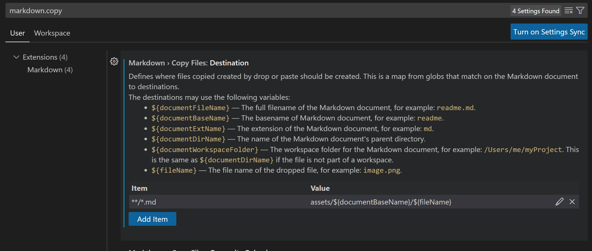

# 知识库

## 开发相关

### git 设置代理

> 针对所有域名的 Git 仓库

```
git config ––global http.proxy http://127.0.0.1:10809
```
> 针对github的 Git 仓库
```
git config ––global http.https://github.com.proxy http://127.0.0.1:10809
```
### pip 使用国内源
> 临时设置
```
pip3 install numpy -i https://pypi.tuna.tsinghua.edu.cn/simple
```
> 永久设置
```
pip config set global.index-url https://pypi.tuna.tsinghua.edu.cn/simple/
pip config set install.trusted-host pypi.tuna.tsinghua.edu.cn
```
### npm，pnpm，yarn 国内源
```
 npm config set registry https://registry.npmmirror.com/
```
### 设置 VSCode 中 Markdown 粘贴图片的位置
> 1. 在VS Code中，按下`Ctrl + ,`，打开设置界面。
> 2. 在搜索框中输入`markdown.copy`, 找到`Markdown> Copy Files:Destination`
> 3. 新增配置项 key 为 `**/*.md` , value 为 你的目标路径。比如我想将图片放在 assets 目录下 markdown文件同名的目录下，那么我就可以设置为 `assets/${documentBaseName}/${fileName}`， 其中 `${documentBaseName}` 代表markdown文件的文件名，`${fileName}` 代表图片的文件名。
> 4. 保存设置即可。



## Windows
### 解除 PowerShell 默认禁止运行 ps脚本
```
set-executionpolicy remotesigned
```
### 安装 PNPM
>1. 进入cmd环境：右键`在终端中打开`,会进入powershell环境，然后输入`cmd`进入cmd环境 (在ps环境下， curl 实际调用 Invoke-WebRequest 无法接受 -x -o 参数，所以需要进入cmd环境操作)
```
curl -L -x http://127.0.0.1:10809 https://github.com/pnpm/pnpm/releases/latest/download/pnpm-win-x64.exe -o pnpm.exe
```
>1. 下载预编译包
```
curl -L -x http://127.0.0.1:10809 https://github.com/pnpm/pnpm/releases/latest/download/pnpm-win-x64.exe -o pnpm.exe
```
>2. 执行安装命令
```
./pnpm.exe setup
```

## Linux
### ubuntu 设置国内源
> Ubuntu 24.04 之前版本
```
sed -i "s/archive.ubuntu.com/mirrors.tuna.tsinghua.edu.cn/g" /etc/apt/sources.list
sed -i "s/security.ubuntu.com/mirrors.tuna.tsinghua.edu.cn/g" /etc/apt/sources.list
```
> Ubuntu 24.04 之后版本
```
sed -i "s/archive.ubuntu.com/mirrors.tuna.tsinghua.edu.cn/g" /etc/apt/sources.list.d/ubuntu.sources
sed -i "s/security.ubuntu.com/mirrors.tuna.tsinghua.edu.cn/g" /etc/apt/sources.list.d/ubuntu.sources
```
### alpine 设置国内源
```
sed -i 's/dl-cdn.alpinelinux.org/mirrors.tuna.tsinghua.edu.cn/g' /etc/apk/repositories
```
## Docker
### 非root用户不使用sudo执行命令
`sudo groupadd docker` ：添加到`groupadd`用户组（已经有docker用户组，所以可以不用再新增docker用户组）
`sudo gpasswd -a $USER docker`：添加当前用户到docker组
`newgrp docker`：更新docker用户组